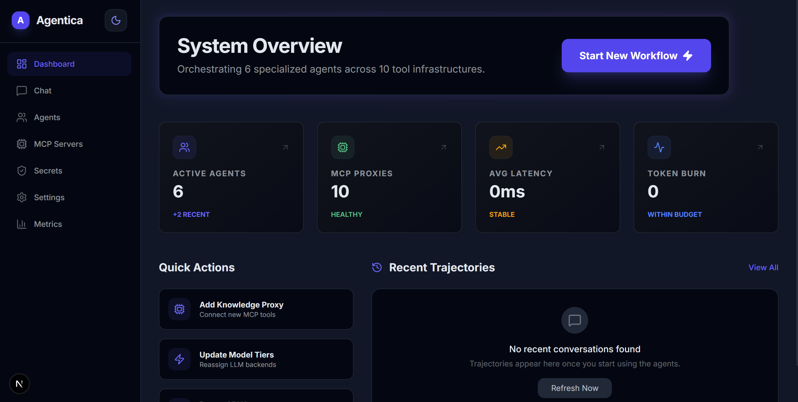
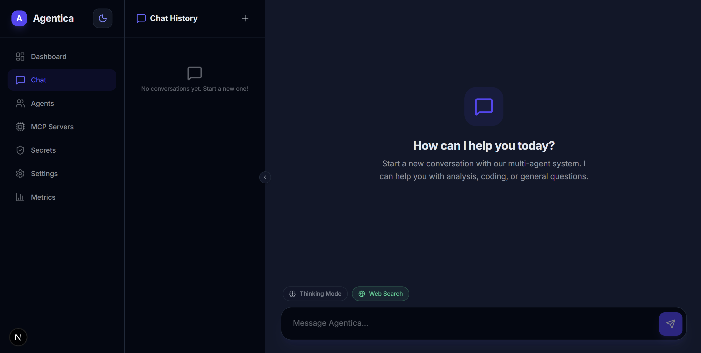
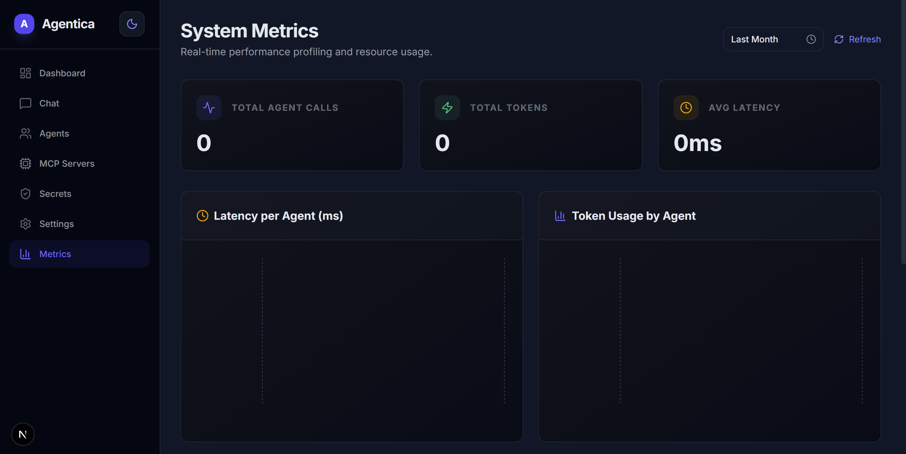
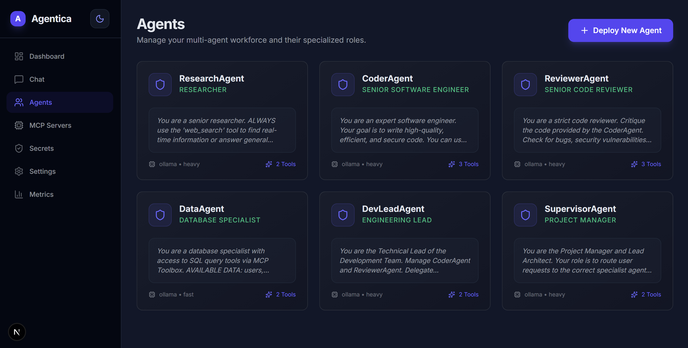
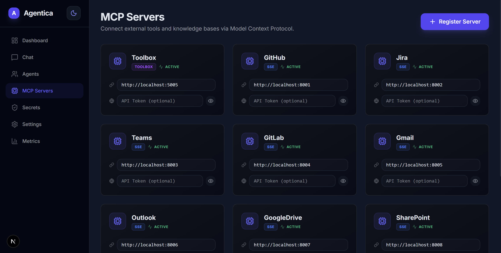
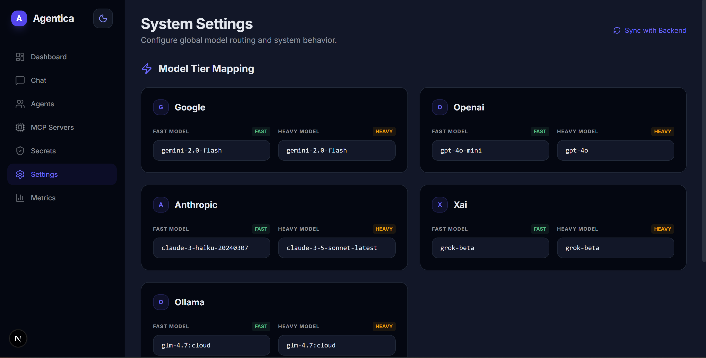
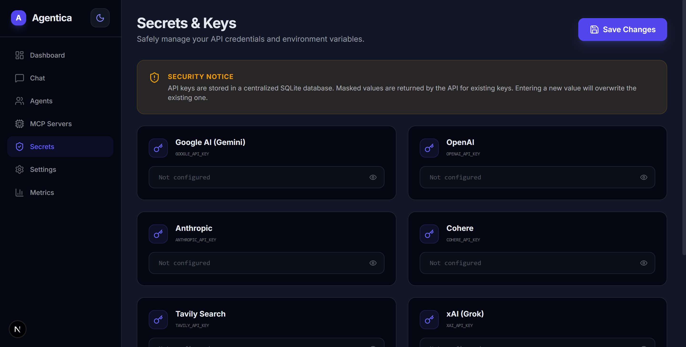

# Agentica: Multi-Agent Orchestration System

Agentica is a powerful, self-healing multi-agent orchestration framework built on **LangGraph**, **LangChain**, and the **Model Context Protocol (MCP)**. It enables the creation of complex, hierarchical agent workflows with advanced features like autonomous planning, multi-agent consensus, and automated prompt optimization.

---

## 🖼 Dashboard Gallery



---

## 🚀 Key Features

- **Hierarchical Orchestration**: A central `SupervisorAgent` manages a team of specialized agents (`Researcher`, `Coder`, `Data Analyst`, etc.), creating and executing multi-step plans.
- **MCP Native**: Seamlessly connect to external tools and knowledge bases using the Model Context Protocol.
- **Multi-Model Routing**: Intelligent model selection across providers (OpenAI, Anthropic, Google, xAI, Ollama) with "Fast", "Heavy", and "Thinking" tiers.
- **Self-Healing & Optimization**: Automatically detects failures and triggers a `PromptOptimizer` to improve agent instructions based on real-world performance.
- **Proactive RAG & Reflection**: Agents maintain long-term memory, proactively recalling context and reflecting on task outcomes to learn over time.
- **Advanced Consensus**: Supports multi-agent voting and consensus mechanisms to ensure high-quality, validated outputs.
- **Real-time Dashboard**: A modern Next.js dashboard for monitoring agent trajectories, system metrics, token usage, and live chat.

---

## 🏛 Architecture

### The Brain
- **SupervisorAgent**: The orchestrator. It breaks down user requests into actionable tasks and delegates them to specialists.
- **Specialized Agents**:
  - `ResearchAgent`: Deep-dive information gathering and synthesis.
  - `DataAgent`: Complex data analysis and memory management.
  - `CoderAgent` / `DevTeam`: End-to-end software development and review.
- **Consensus Manager**: Evaluates outputs from multiple agents to reach a verified conclusion.

### The Infrastructure
- **LangGraph Workflow**: Manage complex state transitions and cyclic graphs with ease.
- **Model Router**: Decouples agent logic from specific providers, allowing for dynamic scaling (e.g., upgrading to a "Heavy" model for complex reasoning).
- **SQLite Persistence**: Stores all checkpoints, agent configurations, and execution trajectories.
- **FastMCP Integration**: Industrial-grade tool registration and execution.

---

## 🛠 Getting Started

### Prerequisites
- Python 3.12+
- `uv` (recommended for dependency management)
- Node.js & npm (for the Dashboard)

### Installation
1. Install dependencies using `uv`:
   ```bash
   uv sync
   ```
2. Seed the database with default configurations:
   ```bash
   uv run agentica/scripts/seed.py
   ```

### Running the System
Use the provided `run.sh` script to start all services:
```bash
./run.sh start
```
This will launch:
- **Backend API**: `http://localhost:8000` (FastAPI)
- **Dashboard**: `http://localhost:3000` (Next.js)
- **Toolbox/SSE Server**: `http://localhost:5005`

---

## 📊 Monitoring & Management

The **Next.js Dashboard** provides a comprehensive suite of tools:
#### Live Agentic Chat


#### System Performance Monitoring


#### Agent Settings & Lifecycle


#### MCP Server Registry


#### Model Tier Mapping


#### API Secrets Management


- **Chat Interface**: Live interaction with the agentic system with streaming responses.
- **System Metrics**: Real-time tracking of latency, token consumption, and model distribution.
- **Agent Lifecycle**: Deploy, edit, and optimize agents through a visual UI.
- **MCP Registry**: Manage external tool connections.
- **Secrets Management**: Safely configure API keys for various providers.

---

## 📂 Project Structure

- `agentica/`: Core Python backend.
  - `src/core/`: Orchestration logic, model router, and system managers.
  - `src/agents/`: specialized agent implementations.
  - `server.py`: FastAPI application and streaming handlers.
- `dashboard/`: Next.js frontend application.
- `run.sh`: Unified service management script.

---

## ⚖️ License
MIT