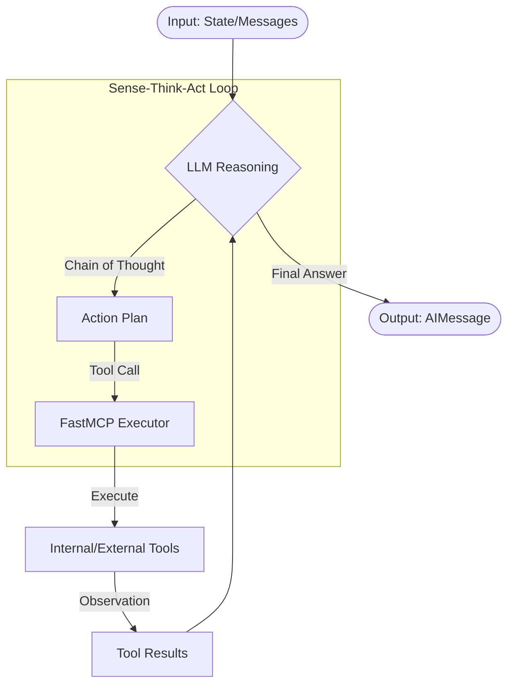
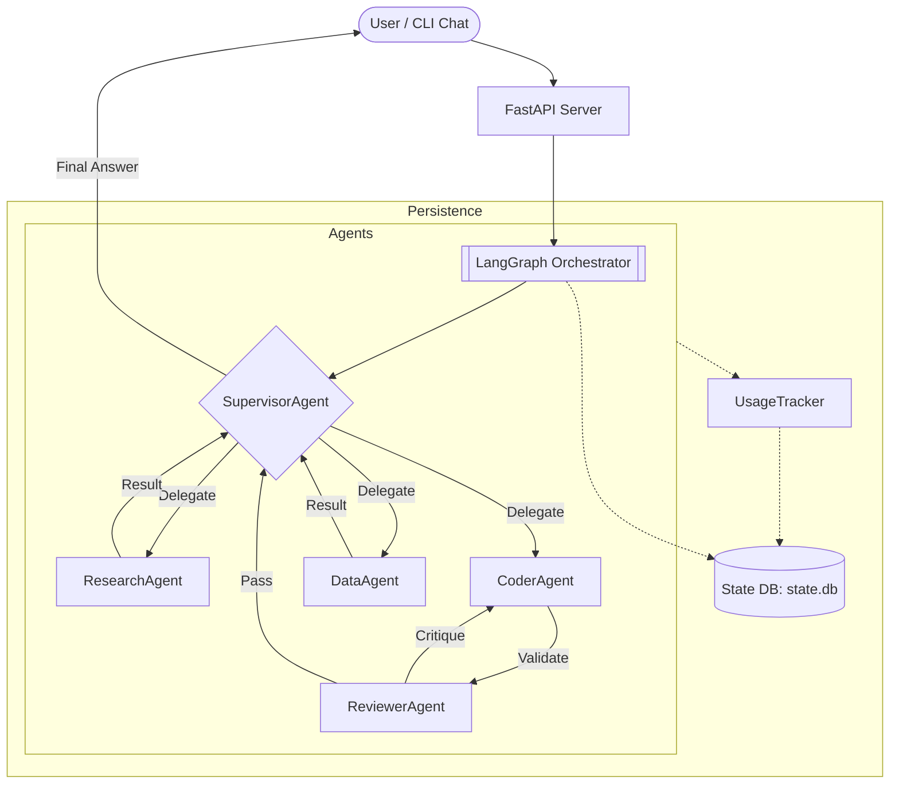
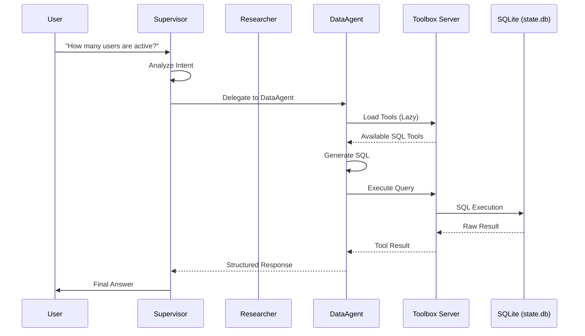
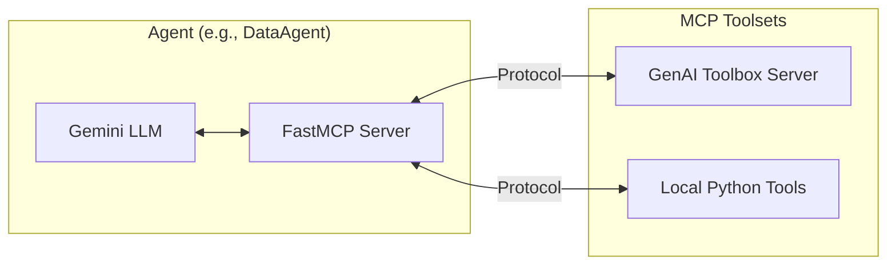
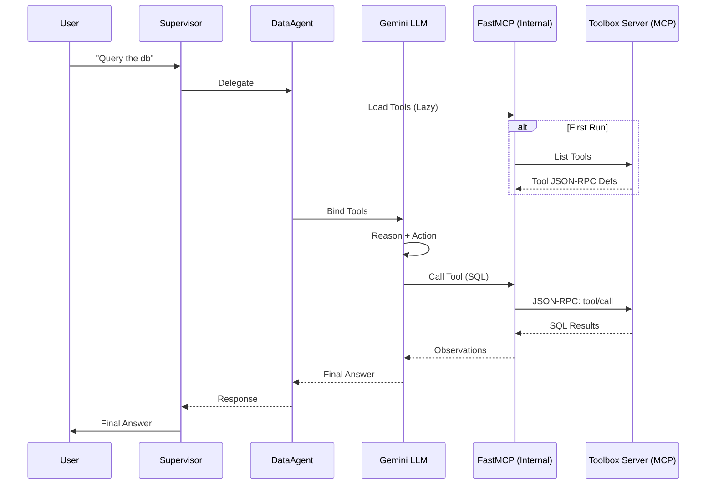

# System Architecture

Agentica is a multi-agent system built on **LangGraph**, designed to orchestrate specialized LLM-powered agents to solve complex tasks.

## Anatomy of an AI Agent

Each agent in the system is an autonomous loop that combines reasoning with tool execution.

## Orchestration Flow

The system uses a **Supervisor-Worker** pattern. The `SupervisorAgent` acts as the brain, analyzing user intent and delegating to specialized workers.

## Agent Capabilities

| Agent | Core Responsibility | Primary Tools |
| :--- | :--- | :--- |
| **Supervisor** | Orchestration & Routing | Internal Routing Logic |
| **Researcher** | Information Gathering | `web_search`, `recall_memory` |
| **Coder** | Logic & Scripting | `python_repl`, `create_tool` |
| **Reviewer** | Quality Assurance | Self-Reflection / critique |
| **Data Specialist**| Database Interaction | `db_query`, `db_schema` (via Toolbox) |

## Component Interactions

## Model Context Protocol (MCP) Integration

The system leverages the **Model Context Protocol (MCP)** to standardize how agents interact with tools and external resources.

### Key MCP Concepts in Agentica:
- **FastMCP**: Each `EnterpriseAgent` hosts a `FastMCP` instance (via `mcp.server.fastmcp`) to manage and expose tools to the LLM in a structured format.
- **Protocol-Based Tools**: Agents register tools using the MCP pattern, which provides a unified interface for both local Python functions and external toolbox servers.
- **JSON-RPC Communication**: Tool discovery and invocation follow the MCP specification, ensuring consistency across different tool providers.

## Component Interactions (MCP-Aware)

## Infrastructure Layer

- **Language Model**: Google Gemini (via `gemini-2.0-flash`).
- **State Management**: LangGraph checkpointing for persistent threads.
- **External Dependencies**: 
  - `googleapis/genai-toolbox` for database sandboxing.
  - `duckduckgo-search` for real-time web access.
  - `structlog` for structured, JSON-based diagnostics.
